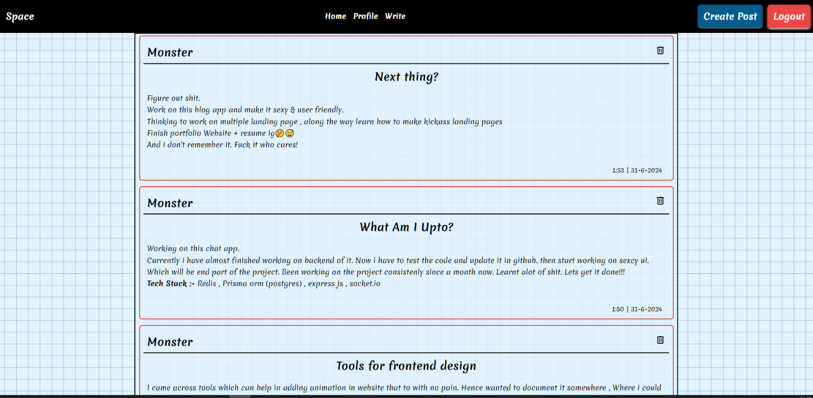
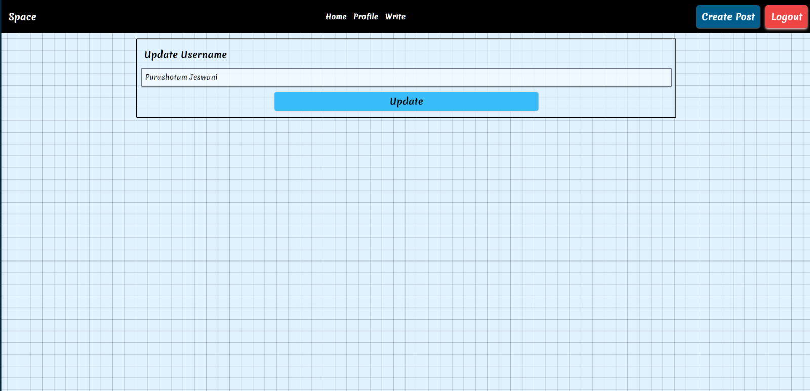
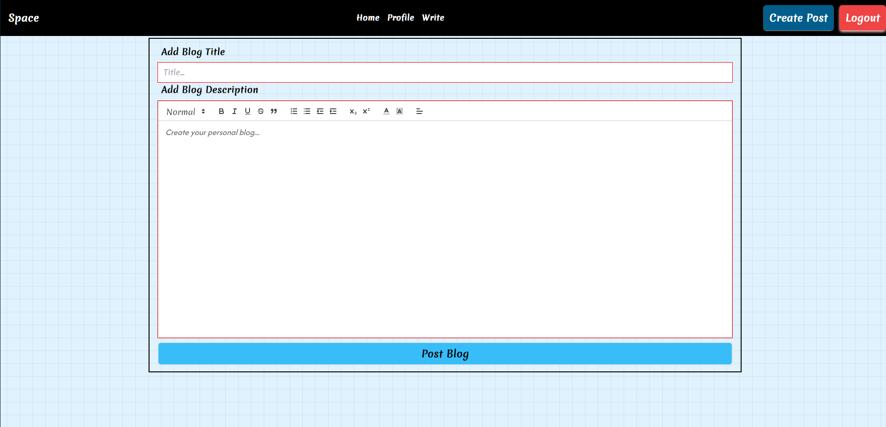
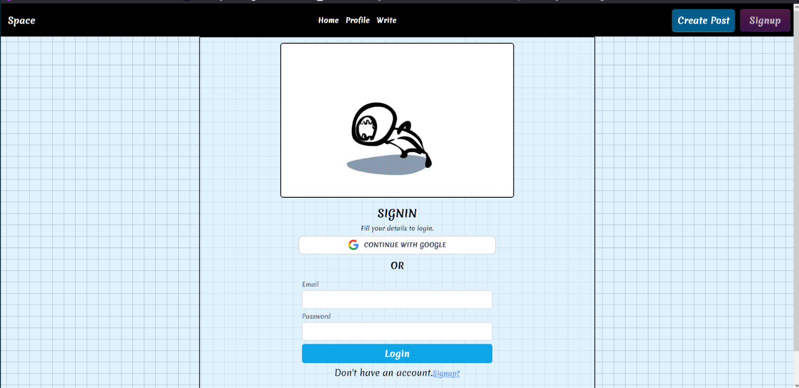

# Space

A Baas Archieture based blog app. Which uses some professient libraries like react-router-dom , ReactQuill , Firebase , React-Toastify. 
Used TailwindCss. 
Will make the code live pretty soon after i am done with all the nesseary update. For the time being below are some screenshot of the code.


## Screenshots







## Installation

How to setup? Run the following commands in terminal to clone the repo & run

```bash
git clone "https://github.com/MrPurushotam/BlogApp.git"
cd BlogApp
npm install
npm start
```

    